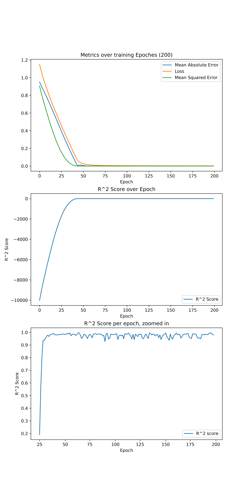
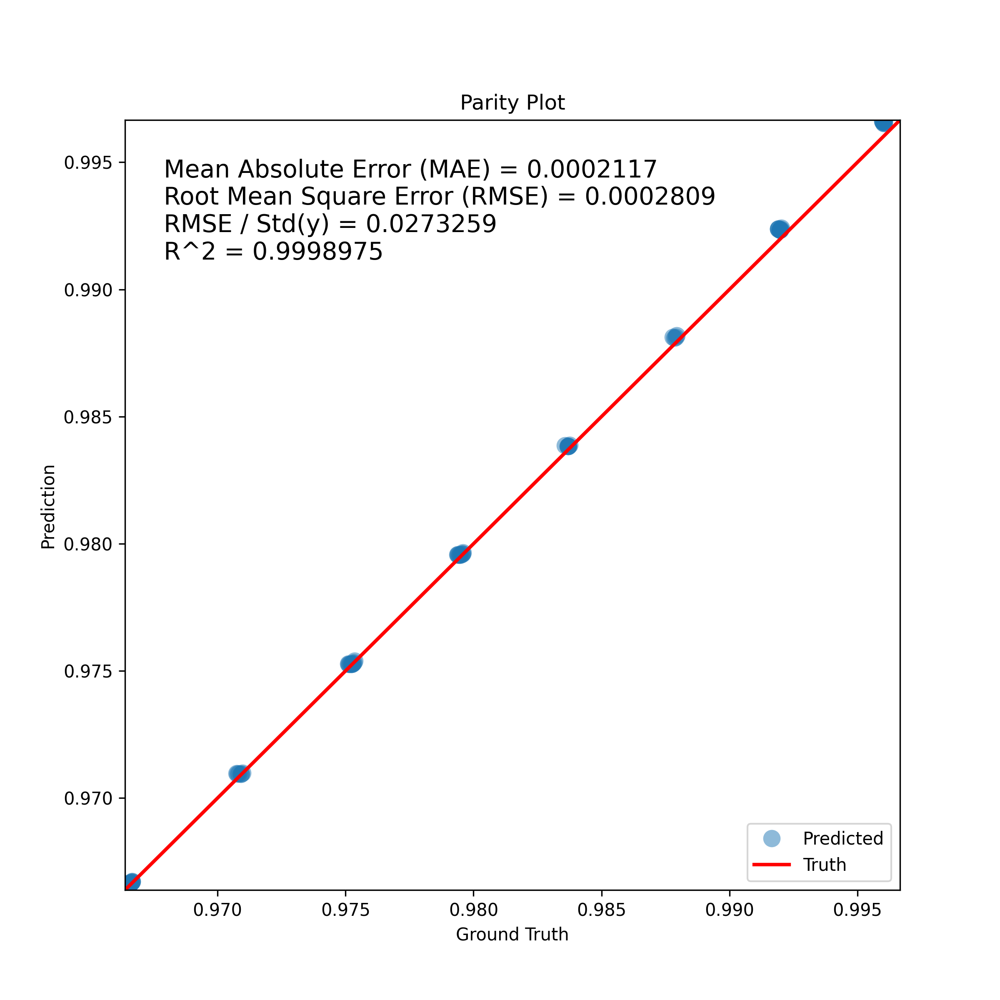

# ANN Modelling of Binary Azeotropic VLE
By Siddhant Mahajan 

## Report
This report covers the following scopes:
- VLE Data Generation
- Statistical Machine Learning
- ANN Model
- Scope of improvement

### VLE Data Generation
Vapor Liquid Equilibrium is a condition where the element in liquid form and its vapor form are in equilibrium under a closed system.
This equilibrium is a function of factors such as the elemental properties, temperature, pressure, mixture properties and more. \
An azeotrope is a mixture of atleast two liquids. Their mixture can either have a higher boiling point than either of the components or they can have a lower boiling point. Thus seperating them by standard distillation is not possible. In azeotropic conditions, the vapor concentration and liquid concentration is the same.\
In this report, I will be covering the Ethanol Water Mixture Azeotropic VLE. 

For a better understanding and closer to accurate modelling of azeotropic behaviour in ML models, it is necessary to have sufficient data. However, literature based on experimentation lacks the required amount of data points (typically 200+ evaluation points). 

Hence, to obtain the required datapoints, I decided to synthetically generate it using the equation models such as DECHEMA, NRTL or Raoult's Law. \
I scripted a NRTL formula in python, and generated a Dataset of 320 points for various Temperature - Pressure - X1 values.

This synthetic data will be utilized to train the ANN model.

### Statistical Machine Learning
The data was scaled using `MinMaxScaler` and later divided into Train and Test units. \
For model scoring, I shall utilize:
- Mean Absolute Error
- Root Mean Squared Error
- $R^2$ Error - measures how the model explains its variance

A simple statistical model `Ridge Regression` was trained and tested on the dataset. It achieved the scores:
- MAE : 0.0003400218709483458
- RMSE : 0.0004074165956204983
- $R^2$ Error : 0.9982528505310561

The scores achieved by our base model are good.
$R^2$ Score of 0.998 indicates that the model can finely express the variances in the data and is not just predicting a linear line of closest fit.

### ANN Model
Data preprocessing will be same to that of Statistical ML. \
I will be using `TensorFlow==2.18` with `CUDA` acceleration enabled.

I created a Sequential ANN Model with following layer dimensions:
- Input Layer with 3 Input nodes, to accept values for `Temperature`, `Pressure` and `x1`.
- Hidden layer of 20 neurons, `tanh` activation and L2 kernel regularizer
- Hidden layer of 30 neurons, `softmax` activation. Softmax activation forces the outputs in the range **0 - 1**.
- Output layer of 1 neuron, `linear` activation. As only output a single value (y1) is required, 1 neuron is sufficient.

I used the `AdamW` optimizer with `learning rate = 0.001, beta_1=0.729, beta_2=0.612`. \
AdamW optimizer was used as it is often superior to Adam with L2 regularization because it decouples weight decay from the gradient update process. This leads to more effective and consistent regularization, better generalization and convergence.
Loss was calculated over **MAE** metric.

The values for Beta 1, Beta 2 and L2 regularization were calculated by hyper parameter tuning over the search space, keeping the $R^2$ score as the metric factor.

Finally, the model was compiled with these parameters.

Model: "sequential"

|Layer (type)|Output Shape|Param #|kwargs|
| :--: | :--: | :--: | :--: |
|dense (Dense)|(None, 20)|80|tanh, L2(0.005)|
|dense_1 (Dense)|(None, 30)|630|softmax|
|dense_2 (Dense)|(None, 1)|31|linear|

` Total params: 741 (2.89 KB)` \
` Trainable params: 741 (2.89 KB)` \
` Non-trainable params: 0 (0.00 B)` 

This model was trained for 150 epochs. \
After training, model achieves:
- $R^2$ Score: 0.9992532933912667
- MAE: 0.00021169877464102121
- RMSE: 0.0002808772539029091

The ANN model predicts the VLE points with a high accuracy.

### Scope of Improvement
1. The data upon which the model is trained is synthetically generated, limited by my understanding and formula-implementation.
2. ANN is trained and accelerated using NVIDIA's CUDA proprietary implementation. This can cause issues when executed on incompatible hardware. Retraining might be required to be compatible on such hardwares.
3. More data points are needed to accurately generate metrics of the model.

### Declaration
The code contributed is made by me (Siddhant Mahajan) using various sources available online including use of Generative AI. However, the code is *NOT ENTIRELY AI GENERATED*. It may be incorrect for real world application however considering the generated data as the source of truth it reflects the actual capabilities.